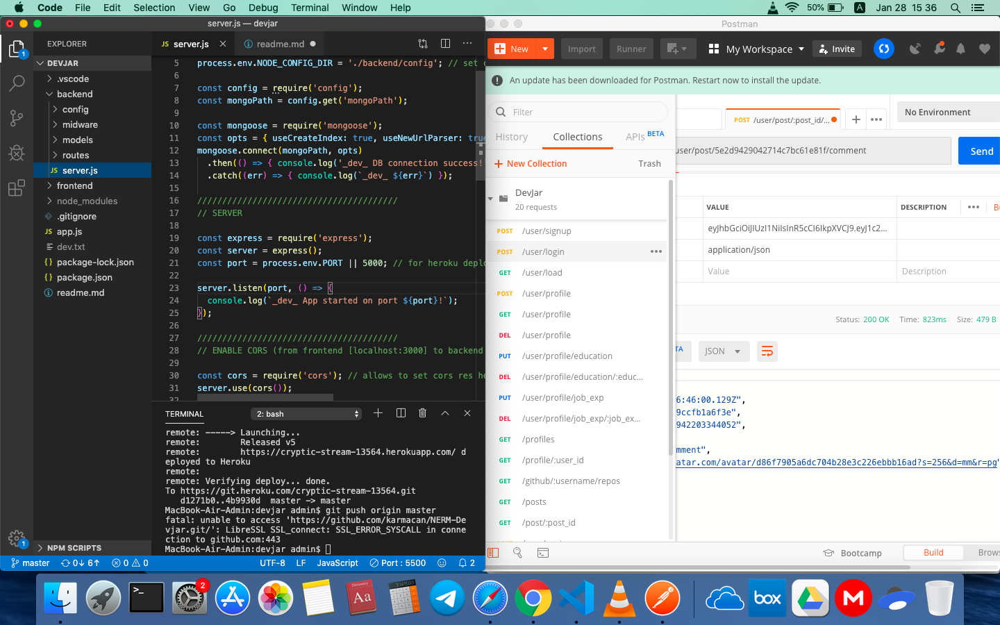
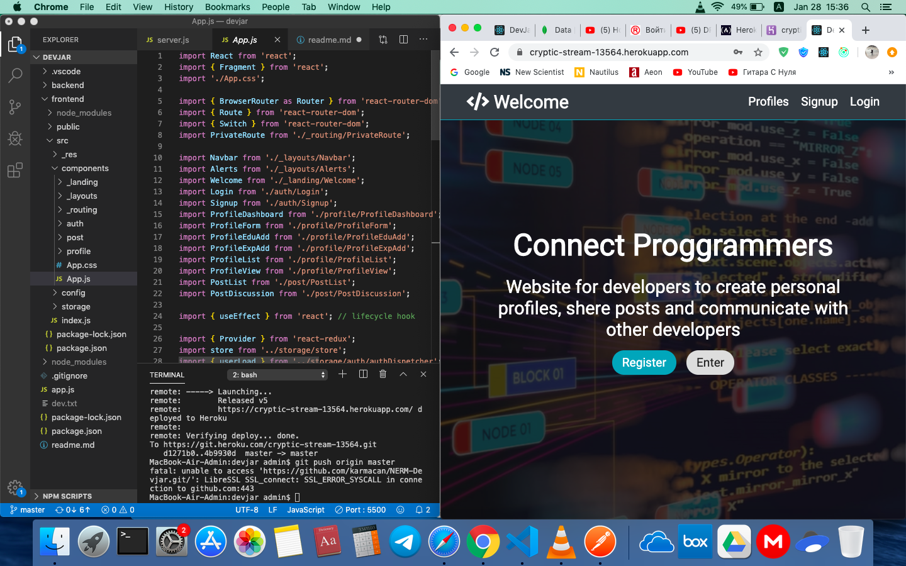

<h1>AlfaClub (Beta)</h1>

# App Discription
AlfaClub is a platform app for developers to connect and share info. In the nutshell, AlfaClub is specified version of LinkedIn for software developers. 
Users can create professional profiles, edit them, add personal job and education experiences, shere social links, connect github account to display repos. Application can be used as post messaging platform with each post can be liked and commented.

# Developement Base
AlfaClub is fullstack application bulit on Node.js, Express, Mongo (backend) and React, Redux, Sass (frontend). App uses MongoDB Atlas as remote db and deployment carried on Heroku.

# App Structure
Application divided on backend and frontend. 
Backend managing api routing via backend routing requests and db interactions. Api logic separated on auth (public), profile (private/public), post (private).
Frontend contains rendering index and components from which it built. Interactions between components executed via frontend routing. Also include storage which load global states and actions.

# Repo Link
https://xxx-alfaclub.herokuapp.com/

<!-- # App Screens
Back

Front
 -->